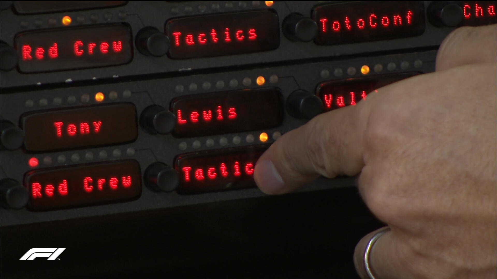
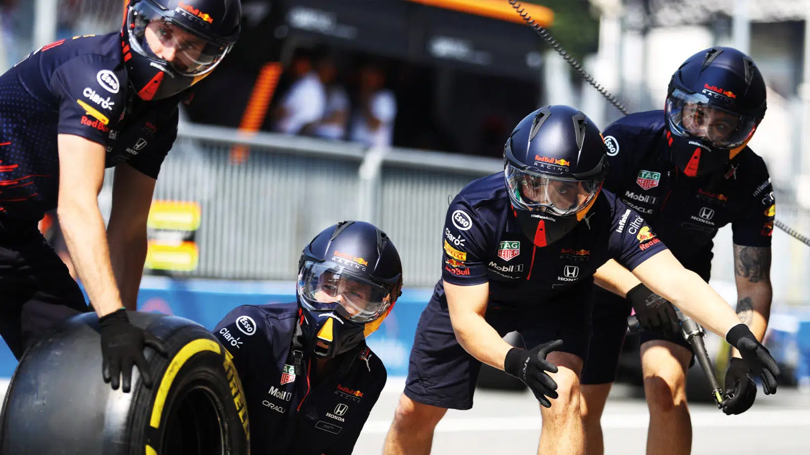
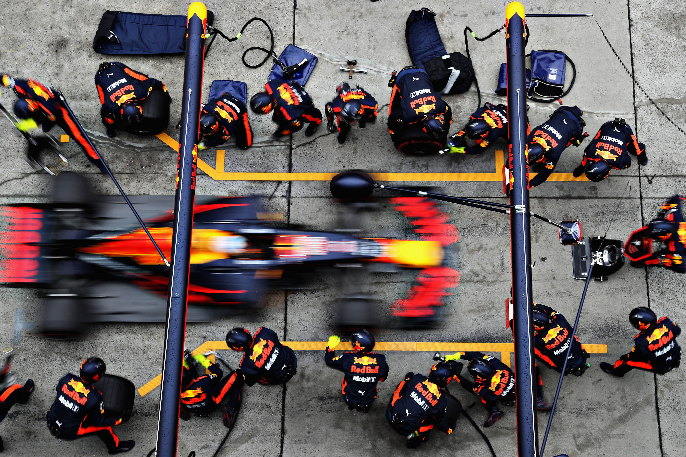
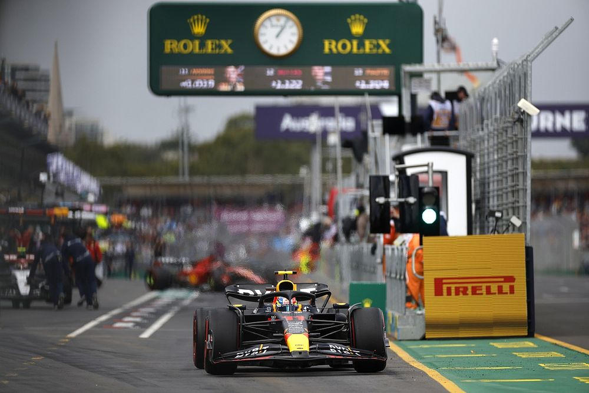
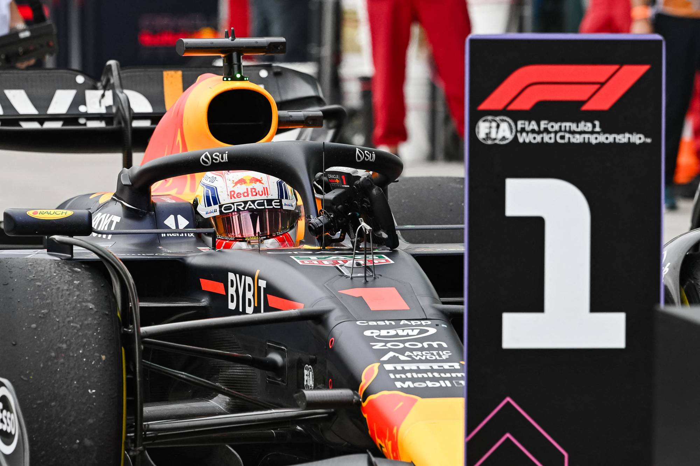
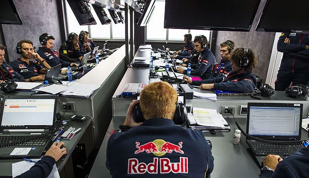

# Chapter 1: Hindsight Bias

Definition: 
‘Knew-it-all-along’ phenomenon that people convince themselves that they predicted an event after it has already happened.

Application:
- Team principal presses tactics button, to call the car in for an early pitstop
- Team prepares for a pitstop
- Team performs the pitstop
- Car leaves the pitlane
- Team wins the race with the strategy having paid off
- Team debriefs with the early pitstop call being the accurate strategy after conclusion of the race

## Images

- 
  Caption: Team principal presses tactics button, to call the car in for an early pitstop

- 
  Caption: Team prepares for a pitstop

- 
  Caption: Team performs the pitstop

- 
  Caption: Car leaves the pitlane

- 
  Caption: Team wins the race with the strategy having paid off

- 
  Caption: Team debriefs with the early pitstop call being the accurate strategy after conclusion of the race
